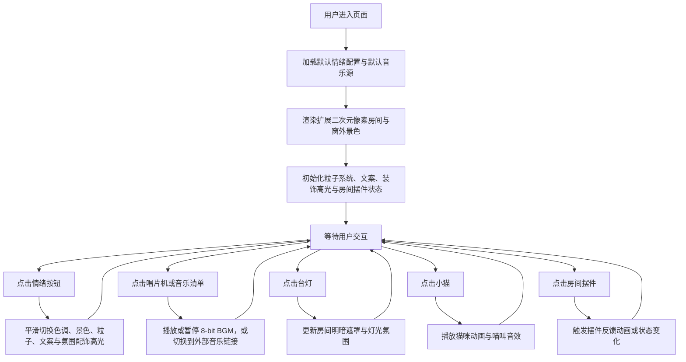

## 1. 产品概述
像素风情绪小屋是一款纯前端单页面 Web 应用，以单文件 HTML 实现一个带有强烈二次元氛围、细节更丰富、可深度互动的像素房间。
- 面向喜欢像素美术、二次元卧室氛围、轻互动陪伴感的用户，提供情绪切换、环境音效、可爱角色互动、房间探索与自选音乐体验
- 产品价值在于用极简技术栈做出高完成度的二次元像素情绪空间，可直接打开运行，适合作为互动艺术页面、同人风展示页与前端作品集亮点

## 2. 核心功能

### 2.1 功能模块
1. **情绪切换区**：顶部像素按钮，支持开心、难过、平静、深夜、孤单五种情绪切换
2. **扩展像素房间主场景**：房间面积更大，增加书桌、书架、游戏机、手办架、零食盒、留言板、窗边小盆栽等二次元卧室细节
3. **窗外景色系统**：使用 CSS/Canvas 绘制不同情绪对应的像素景色与天气粒子
4. **音频系统**：同时支持 Web Audio API 生成的 8-bit BGM 与可切换的外部音乐链接播放清单
5. **氛围交互系统**：台灯开关影响房间明暗，小猫点击触发更自然的像素动画，挂画文案随情绪切换并以打字机效果展示
6. **房间互动系统**：部分新增摆件可点击触发轻反馈，例如书桌小屏亮起、游戏机灯闪烁、留言板短语切换、星星挂饰摇晃
7. **二次元装饰系统**：房间内加入像素蝴蝶结、心形摆件、月亮吊饰、漫画分镜感高光与挂画边框等二次元符号化元素，增强角色感与陪伴感

### 2.2 页面详情
| 页面名称 | 模块名称 | 功能描述 |
|-----------|-------------|-------------|
| 情绪小屋单页 | 顶部情绪栏 | 展示五个像素按钮，hover 高亮，点击后触发整屋色调、景色、粒子、文案和旋律平滑过渡 |
| 情绪小屋单页 | 房间场景 | 以像素风绘制更开阔的房间结构、家具和装饰，整体限制在 16 色以内的复古色板风格，同时加入更丰富的二次元卧室摆件与少女感细节 |
| 情绪小屋单页 | 窗户区域 | 根据情绪渲染太阳花田、细雨灰天、湖泊远山、星空弯月、飘雪街道等不同窗景，并让窗框有像素蕾丝或星点装饰感 |
| 情绪小屋单页 | 粒子画布层 | 在房间上方叠加 Canvas 方块粒子，实现光点、雨滴、雪粒、萤火虫等像素特效 |
| 情绪小屋单页 | 唱片机与 BGM 清单 | 点击切换播放/暂停，播放时唱片进行像素旋转帧动画；用户可从内置 8-bit、外部音乐链接、自定义清单中选择播放源 |
| 情绪小屋单页 | 台灯 | 点击切换开关，改变房间暗色遮罩透明度，形成明暗变化，并让灯罩具备可爱的像素心形或花边造型 |
| 情绪小屋单页 | 小猫 | 点击后播放约 2 秒的更自然像素动画，并触发短促喵叫音效；猫咪造型更接近真实趴卧猫，减少抽象感 |
| 情绪小屋单页 | 房间摆件互动 | 书桌、掌机、手办架、留言板、零食盒等可做轻量点击反馈，增强探索感 |
| 情绪小屋单页 | 挂画文案 | 根据当前情绪从内置文案池取一句治愈短文案，切换时以逐字打字机效果显示；挂画造型偏二次元海报或角色应援牌 |

## 3. 核心流程
用户打开页面后，默认进入一种初始情绪房间；用户可切换情绪以改变房间氛围，也可独立与唱片机、台灯、小猫和房间摆件交互。用户还能在内置 8-bit BGM 与外部音乐链接清单之间切换，形成更个人化的沉浸体验。整体体验强调“像住进二次元像素卧室一样”的陪伴感、收纳感与氛围沉浸感。

## 4. 用户界面设计
### 4.1 设计风格
- 主色与辅助色：以暖色基底为核心，结合 GameBoy / PICO-8 灵感的 16 色以内复古像素色板；每种情绪通过局部色相偏移形成独特氛围
- 按钮风格：高对比像素按钮，使用块状边框、内阴影与 hover 高亮边框，并加入二次元游戏 UI 常见的糖果色高光
- 字体与字号：使用像素字体 Press Start 2P，标题与按钮用更有节奏的字距，营造掌机恋爱游戏式界面感
- 布局风格：桌面优先的单屏居中布局，上方功能栏，下方更大的房间舞台与右侧控制面板，整体呈掌机恋爱游戏 + 像素房间展示框感
- 图标/装饰建议：统一使用像素块、十字光点、方形粒子、蝴蝶结、星星、月亮、心形、蕾丝边框、应援牌和摆件轮廓等二次元符号化元素

### 4.2 页面设计概览
| 页面名称 | 模块名称 | UI 元素 |
|-----------|-------------|-------------|
| 情绪小屋单页 | 页面外框 | 居中舞台、像素边框、暖色背景晕染、轻微缩放阴影，并有漫画感描边和闪片高光 |
| 情绪小屋单页 | 情绪按钮 | 横向排列、支持换行、选中态高亮、hover 边框闪烁感，像掌机视觉小说选项条 |
| 情绪小屋单页 | 房间主体 | 像素墙面、地板、窗框、家具、猫与挂画，加入书桌、手办架、掌机、留言板、星星吊饰、玩偶抱枕、蝴蝶结边饰、应援海报感挂画等二次元细节 |
| 情绪小屋单页 | 粒子层 | 全屏幕仅覆盖舞台区域，方形粒子带速度与透明度差异，实现情绪化动态氛围 |
| 情绪小屋单页 | 音乐控制区 | 展示当前播放模式、可切换内置/外链音频、自选歌单按钮、播放状态指示 |
| 情绪小屋单页 | 文案区 | 挂画内嵌像素文本框，逐字显现，控制每次显示长度避免破坏构图，并有 Galgame 式温柔台词感 |

### 4.3 响应式设计
- 采用桌面优先设计，主舞台在大屏居中显示
- 在手机端通过整体缩放、按钮换行、面板纵向堆叠与字体缩小保持完整可见
- 触控区域增大，确保台灯、唱片机、小猫和新增摆件在移动端也可稳定点击
- Canvas 与房间舞台尺寸联动，保证粒子特效在不同屏幕下仍贴合场景
