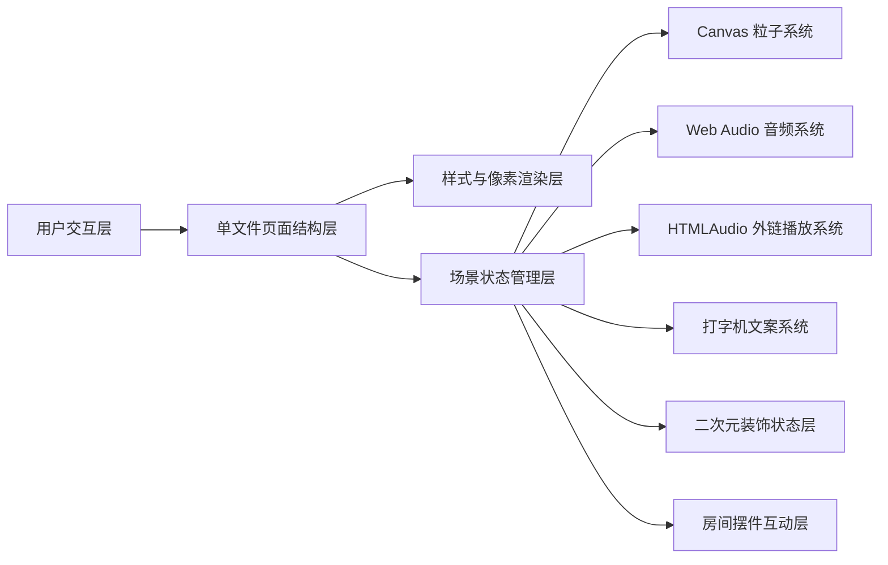

## 1. 架构设计


## 2. 技术说明
- 前端：原生 HTML5 + CSS3 + 原生 JavaScript
- 初始化方式：无需构建工具，直接创建单文件 `index.html`
- 后端：无
- 数据：前端内置情绪配置、文案池、旋律数组、像素帧数据、二次元装饰参数、外部音乐链接清单与房间摆件交互配置

## 3. 路由定义
| 路由 | 用途 |
|-------|------|
| / | 展示二次元像素风情绪小屋单页面，并承载全部视觉、交互、音频与动画逻辑 |

## 4. 模块设计
### 4.1 页面结构模块
- 顶部情绪切换条：负责显示情绪按钮与当前状态
- 中央视觉舞台：承载更大房间主体、物件、遮罩与 Canvas 粒子层
- 挂画文案区域：负责逐字展示当前情绪文案
- 二次元装饰层：负责表现蝴蝶结、星月挂饰、玩偶摆件、糖果高光等静态或弱动态元素
- 音乐控制面板：负责切换内置 BGM、外部音频链接与播放列表状态

### 4.2 状态管理模块
- `currentMood`：当前情绪键值
- `lampOn`：台灯开关状态
- `musicMode`：当前音乐模式，区分 `synthetic` 与 `external`
- `isPlaying`：当前是否播放音频
- `currentTrackIndex`：当前外部音乐曲目索引
- `catAnimating`：小猫是否处于 2 秒动画窗口
- `typedText`：当前正在显示的挂画文案
- `particles`：粒子数组与粒子配置
- `decorVariant`：当前情绪下的装饰高光与挂件表现配置
- `propStates`：房间摆件的轻量状态，如书桌亮屏、掌机闪灯、留言板文本等

### 4.3 音频模块
- 使用 `AudioContext` 管理合成 8-bit BGM 输出
- 使用 `OscillatorNode`、`GainNode`、`BiquadFilterNode` 组合生成 8-bit 风格旋律
- 使用原生 `HTMLAudioElement` 播放可配置的外部音乐链接
- 切换音乐模式时自动停止另一种播放源，避免叠加
- 小猫音效采用短时频率滑音与快速衰减增益模拟喵叫

### 4.4 粒子模块
- 独立 Canvas 叠加在房间上方
- 使用方块粒子实现阳光光点、雨滴、雪花、萤火虫等效果
- 切换情绪时重建粒子参数并平滑过渡颜色与速度分布

### 4.5 像素渲染模块
- 房间与大部分物件优先使用 CSS 盒模型和 `box-shadow` 营造像素块感
- 窗外景色与粒子用 Canvas 绘制，以便实现连续天气动画
- 唱片机旋转、小猫帧动画、按钮高亮、摆件反馈和房间明暗通过 CSS 动画与过渡实现
- 二次元要素通过额外的像素挂件、海报边框、爱心灯罩、星星链饰与糖果色局部描边实现，不引入外部图片

## 5. 数据定义
### 5.1 情绪配置结构
```ts
interface MoodConfig {
  key: string
  label: string
  palette: {
    bg: string
    wall: string
    floor: string
    accent: string
    windowSky: string
    particle: string
    overlay: string
    cute: string
  }
  scene: 'happy' | 'sad' | 'calm' | 'night' | 'lonely'
  particles: {
    type: string
    count: number
    speedX: [number, number]
    speedY: [number, number]
    size: number
  }
  decor: {
    ribbon: boolean
    stars: boolean
    plush: boolean
    frameStyle: 'poster' | 'lace' | 'idol'
  }
  melody: Array<{ note: number; length: number }>
  quotes: string[]
}
```

### 5.2 外部音乐结构
```ts
interface TrackItem {
  title: string
  artist: string
  url: string
  mood?: string
}
```

### 5.3 房间摆件状态
- 书桌显示状态可切换亮屏/待机
- 留言板可轮播短句
- 掌机可切换灯光像素块
- 手办架可做轻微高亮反馈
- 小猫像素帧改为更接近趴卧真实猫的轮廓和五官比例

## 6. 实现约束
- 必须为单文件 HTML，可双击直接运行
- 禁止依赖外部图片资源
- 字体通过 `@import` 或 `@font-face` 引入像素字体，若网络不可用则退回等宽字体
- 视觉色板总量控制在 16 色以内，并通过 CSS 变量统一管理
- 所有主要过渡需具备平滑体验，包括色调、遮罩、文案、装饰高光、粒子变化和摆件反馈
- 所有二次元元素必须仍保持像素风表达，不可转向高清插画风
- 外部音频链接需允许浏览器跨域播放；若链接不可播放，界面应给出可理解的状态提示

## 7. 验证策略
- 手动打开页面验证桌面与窄屏布局
- 验证五种情绪切换时的房间颜色、窗景、粒子、文案、装饰细节和旋律是否同步变化
- 验证唱片机播放/暂停、台灯开关、小猫点击动画与音效是否正常
- 验证外部音乐清单切换、播放状态同步、失败提示与模式切换是否正常
- 验证新增房间摆件的交互反馈在手机与桌面均不会遮挡核心物件
- 验证无图片依赖、无构建步骤、可直接本地运行
